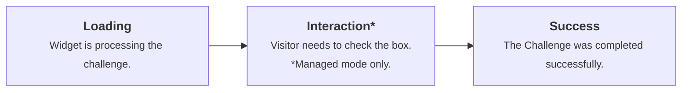

# Cloudflare Turnstile Documentation
\n## Index
---
title: Cloudflare Turnstile
pcx_content_type: overview
description: Verify visitors are human with a CAPTCHA-free, privacy-preserving alternative.
products:
  - turnstile
tags:
  - Privacy
sidebar:
  order: 1
head:
  - tag: title
    content: Overview
---

import {
	Description,
	Feature,
	LinkButton,
	Plan,
	RelatedProduct,
	Render,
	Stream,
	CardGrid,
	LinkTitleCard,
} from "~/components";

<Description>

Cloudflare's smart CAPTCHA alternative.

</Description>

Turnstile can be embedded into any website without sending traffic through Cloudflare and works without showing visitors a CAPTCHA.

<Stream
	id="7f1104dc5895d96c1957a4db5fdf496a"
	title="Get started with Cloudflare Turnstile"
	thumbnail="https://imagedelivery.net/xDOJvHcv1KwTQn6S-BGFIw/5b75f329-b7fe-4122-cae4-9bee54c35100/public"
/>

<Render file="challenge-behavior" product="turnstile" />

## How Turnstile works


Turnstile adapts the challenge outcome to the individual visitor or browser. First, we run a series of small non-interactive JavaScript challenges to gather signals about the visitor or browser environment.

These challenges include proof-of-work (computational puzzles), proof-of-space, probing for web APIs, and various other challenges for detecting browser-quirks and human behavior. As a result, we can fine-tune the difficulty of the challenge to the specific request and avoid showing a visual or interactive puzzle to a user.

Turnstile performs client-side security challenges on behalf of the website operator to distinguish human visitors from automated traffic. To do so, Turnstile processes only the data strictly necessary to provide this security function. Turnstile does not access, store, or transmit user communications, form entries, or other page inputs.

:::note
For detailed information on Turnstile's data privacy practices, refer to the [Turnstile Privacy Addendum](https://www.cloudflare.com/turnstile-privacy-policy/).
:::

### Widget types

Turnstile [widget types](/turnstile/concepts/widget/) include:

- **Managed** (recommended): Automatically decides whether to show a checkbox based on visitor risk level.
- **Non-interactive**: Visitors never need to interact with the widget.
- **Invisible**: The widget is completely hidden from the visitor.

---

## Accessibility

Turnstile is WCAG 2.2 AA compliant.

---

## Features

<Feature header="Turnstile Analytics" href="/turnstile/turnstile-analytics/">
	Assess the number of challenges issued, evaluate the [challenge solve
	rate](/cloudflare-challenges/reference/challenge-solve-rate/), and view the
	metrics of issued challenges.
</Feature>

<Feature
	header="Pre-clearance"
	href=" /cloudflare-challenges/concepts/clearance/#pre-clearance-support-in-turnstile"
>
	Integrate Cloudflare challenges on single-page applications (SPAs) by allowing
	Turnstile to issue a Pre-Clearance cookie.
</Feature>

---

## Related products

<RelatedProduct header="Bots" href="/bots/" product="bots">
	Cloudflare bot solutions identify and mitigate automated traffic to protect
	your domain from bad bots.
</RelatedProduct>

<RelatedProduct
	header="DDoS Protection"
	href="/ddos-protection/"
	product="ddos-protection"
>
	Detect and mitigate Distributed Denial of Service (DDoS) attacks using
	Cloudflare's Autonomous Edge.
</RelatedProduct>

<RelatedProduct header="WAF" href="/waf/" product="waf">
	Get automatic protection from vulnerabilities and the flexibility to create
	custom rules.
</RelatedProduct>

---

## More resources

<CardGrid>
<LinkTitleCard title="Plans" href="/turnstile/plans/" icon="document">

Learn more about Turnstile's plan availability.

</LinkTitleCard>
</CardGrid>
\n## Get Started - Client Side
---
title: Embed the widget
pcx_content_type: get-started
description: Embed a Turnstile widget on your website with JavaScript or HTML.
products:
  - turnstile
tags:
  - JavaScript
  - SPA
sidebar:
  order: 3
---

import { Render, Tabs, TabItem, Steps, Details } from "~/components";

Learn how to add the Turnstile widget to your webpage using implicit or explicit rendering methods.

Turnstile offers two ways to add widgets to your page. **Implicit rendering** automatically scans your HTML for widget containers when the page loads. **Explicit rendering** gives you programmatic control to create widgets at any time using JavaScript. Use implicit rendering for static pages where forms exist at page load. Use explicit rendering for dynamic content and single-page applications (SPAs) where forms are created after the initial page load.

| Feature                 | Implicit rendering                 | Explicit rendering                 |
| ----------------------- | ---------------------------------- | ---------------------------------- |
| **Ease of setup**       | Simple, minimal code               | Requires additional JavaScript     |
| **Control over timing** | Renders automatically on page load | Full control over rendering timing |
| **Use cases**           | Static content                     | Dynamic or interactive content     |
| **Customization**       | Limited to HTML attributes         | Extensive via JavaScript API       |

## Prerequisites

Before you begin, you must have:

- A Cloudflare account
- [A Turnstile widget](/turnstile/get-started/#1-create-your-widget) with a sitekey
- Access to edit your website's HTML
- Basic knowledge of HTML and JavaScript

## Process

1. Page load: The Turnstile script loads and scans for elements or waits for programmatic calls.
2. Widget rendering: Widgets are created and begin running challenges.
3. Token generation: When a challenge is completed, a token is generated.
4. Form integration: The token is made available via callbacks or hidden form fields.
5. Server validation: Your server receives the token and validates it using the Siteverify API.

## Implicit rendering

Implicit rendering automatically scans your HTML for elements with the `cf-turnstile` class and renders widgets without additional JavaScript code. This set up is ideal for static pages where you want the widget to load immediately when the page loads.

### Use cases

Cloudflare recommends using implicit rendering on the following scenarios:

- You have simple implementations and want a quick integration.
- You have static websites with straightforward forms.
- You want widgets to appear immediately on pageload.
- You do not need programmatic control of the widget.

### Implementation

#### 1. Add the Turnstile script

**Include the Turnstile Script**: Add the Turnstile JavaScript API to your HTML file within the `<head>` section or just before the closing `</body>` tag.

```html wrap
<script
	src="https://challenges.cloudflare.com/turnstile/v0/api.js"
	async
	defer
></script>
```

:::caution
The `api.js` file must be fetched from the exact URL shown above. Proxying or caching this file will cause Turnstile to fail when future updates are released.
:::

#### 2. (Optional) Optimize performance with resource hints

Add resource hints to improve loading performance by establishing early connections to Cloudflare servers. Place this `<link>` tag in your HTML `<head>` section before the Turnstile script.

```html wrap
<link rel="preconnect" href="https://challenges.cloudflare.com" />
```

#### 3. Add widget elements

Add widget containers where you want the challenges to appear on your website.

```html wrap
<div class="cf-turnstile" data-sitekey="<YOUR-SITE-KEY>"></div>
```

#### 4. Configure with data attributes

[Customize your widgets](/turnstile/get-started/client-side-rendering/widget-configurations/) using data attributes. Insert a `div` element where you want the widget to appear.

```html
<div
	class="cf-turnstile"
	data-sitekey="<YOUR-SITE-KEY>"
	data-theme="light"
	data-size="normal"
	data-callback="onSuccess"
></div>
```

Once a challenge has been solved, a token is passed to the success callback. This token must be validated against our [Siteverify endpoint](/turnstile/get-started/server-side-validation/).

### Complete implicit rendering examples by use case

<Details header="Basic login form">
Turnstile is often used to protect forms on websites such as login forms or contact forms. You can embed the widget within your `<form>` tag.
```html title="Example"
<!DOCTYPE html>
<html>
<head>
    <title>Login Form</title>
    <script src="https://challenges.cloudflare.com/turnstile/v0/api.js" async defer></script>
</head>
<body>
    <form action="/login" method="POST">
        <input type="text" name="username" placeholder="Username" autocomplete="username" required />
        <input type="password" name="password" placeholder="Password" autocomplete="current-password" required />

        <!-- Turnstile widget with basic configuration -->
        <div class="cf-turnstile" data-sitekey="<YOUR-SITE-KEY>"></div>
        <button type="submit">Log in</button>
    </form>

</body>
</html>
```

An invisible input with the name `cf-turnstile-response` is added and will be sent to the server with the other fields.

```html title="Complete HTML example"
<!DOCTYPE html>
<html lang="en">
	<head>
		<meta charset="UTF-8" />
		<title>Implicit Rendering with Cloudflare Turnstile</title>
		<script
			src="https://challenges.cloudflare.com/turnstile/v0/api.js"
			async
			defer
		></script>
	</head>
	<body>
		<h1>Contact Us</h1>
		<form action="/submit" method="POST">
			<label for="name">Name:</label><br />
			<input type="text" id="name" name="name" required /><br />
			<label for="email">Email:</label><br />
			<input type="email" id="email" name="email" required /><br />
			<!-- Turnstile Widget -->
			<div class="cf-turnstile" data-sitekey="<YOUR-SITE-KEY>"></div>
			<br />
			<button type="submit">Submit</button>
		</form>
	</body>
</html>
```

</Details>

<Details header="Advanced form with callbacks">

```html title="Example"
<form action="/contact" method="POST" id="contact-form">
	<input type="email" name="email" placeholder="Email" required />
	<textarea name="message" placeholder="Message" required></textarea>
	<!-- Widget with callbacks and custom configuration -->
	<div
		class="cf-turnstile"
		data-sitekey="<YOUR-SITE-KEY>"
		data-theme="auto"
		data-size="flexible"
		data-callback="onTurnstileSuccess"
		data-error-callback="onTurnstileError"
		data-expired-callback="onTurnstileExpired"
	></div>
	<button type="submit" id="submit-btn" disabled>Send Message</button>
</form>

<script>
	function onTurnstileSuccess(token) {
		console.log("Turnstile success:", token);
		document.getElementById("submit-btn").disabled = false;
	}
	function onTurnstileError(errorCode) {
		console.error("Turnstile error:", errorCode);
		document.getElementById("submit-btn").disabled = true;
	}
	function onTurnstileExpired() {
		console.warn("Turnstile token expired");
		document.getElementById("submit-btn").disabled = true;
	}
</script>
```

</Details>

<Details header="Multiple widgets with different configurations">

```html title="Example"
<!-- Compact widget for newsletter signup -->
<form action="/newsletter" method="POST">
	<input type="email" name="email" placeholder="Email" />
	<div
		class="cf-turnstile"
		data-sitekey="<YOUR-SITE-KEY>"
		data-size="compact"
		data-action="newsletter"
	></div>
	<button type="submit">Subscribe</button>
</form>

<!-- Normal widget for contact form -->
<form action="/contact" method="POST">
	<input type="text" name="name" placeholder="Name" />
	<input type="email" name="email" placeholder="Email" />
	<textarea name="message" placeholder="Message"></textarea>
	<div
		class="cf-turnstile"
		data-sitekey="<YOUR-SITE-KEY>"
		data-action="contact"
		data-theme="dark"
	></div>
	<button type="submit">Send</button>
</form>
```

</Details>

<Details header="Automatic form integration">

When you embed a Turnstile widget inside a `<form>` element, an invisible input field with the name `cf-turnstile-response` is automatically created. This field contains the verification token and gets submitted with your other form data.

```html
<form action="/submit" method="POST">
	<input type="text" name="data" />
	<div class="cf-turnstile" data-sitekey="<YOUR-SITE-KEY>"></div>
	<!-- Hidden field automatically added: -->
	<!-- <input type="hidden" name="cf-turnstile-response" value="TOKEN_VALUE" /> -->
	<button type="submit">Submit</button>
</form>
```

</Details>

---

## Explicit rendering

Explicit rendering gives you programmatic control over when and where the widget appears and how the widgets are created using JavaScript functions. This method is suitable for dynamic content, single-page applications (SPAs), or conditional rendering based on user interactions.

### Use cases

Cloudflare recommends using explicit rendering on the following scenarios:

- You have dynamic websites and single-page applications (SPAs).
- You need to control the timing of widget creation.
- You want to conditionally render the widget based on visitor interactions.
- You want multiple widgets with different configurations.
- You have complex applications requiring widget lifecycle management.

### Implementation

#### 1. Add the script to your website with explicit rendering

```html wrap
<script
	src="https://challenges.cloudflare.com/turnstile/v0/api.js?render=explicit"
	defer
></script>
```

#### 2. Create container elements

Create containers without the `cf-turnstile` class.

```html
<div id="turnstile-container"></div>
```

#### 3. Render the widgets programmatically

Call `turnstile.render()` when you are ready to create the widget.

```js
const widgetId = turnstile.render("#turnstile-container", {
	sitekey: "<YOUR-SITE-KEY>",
	callback: function (token) {
		console.log("Success:", token);
	},
});
```

### Optional calls

After rendering the Turnstile widget explicitly, you may need to interact with it based on your application's requirements. Refer to the sections below to manage the widget's state.

#### Reset a widget

To reset the widget if the given widget timed out or expired, you can use the function:

```js
turnstile.reset(widgetId);
```

#### Get the response token

Retrieve the current response token at any time:

```js
const responseToken = turnstile.getResponse(widgetId);
```

#### Remove a widget

When a widget is no longer needed, it can be removed from the page using:

```js
turnstile.remove(widgetId);
```

This will not call any callback and will remove all related DOM elements.

### Complete explicit rendering examples by use case

<Details header="Basic explicit implementation">

```html title="Example"
<!DOCTYPE html>
<html>
	<head>
		<title>Explicit Rendering</title>
		<script
			src="https://challenges.cloudflare.com/turnstile/v0/api.js?render=explicit"
			defer
		></script>
	</head>
	<body>
		<form id="login-form">
			<input
				type="text"
				name="username"
				placeholder="Username"
				autocomplete="username"
			/>
			<input
				type="password"
				name="password"
				placeholder="Password"
				autocomplete="current-password"
			/>
			<div id="turnstile-widget"></div>
			<button type="submit">Login</button>
		</form>

		<script>
			window.onload = function () {
				turnstile.render("#turnstile-widget", {
					sitekey: "<YOUR-SITE-KEY>",
					callback: function (token) {
						console.log("Turnstile token:", token);
						// Handle successful verification
					},
					"error-callback": function (errorCode) {
						console.error("Turnstile error:", errorCode);
					},
				});
			};
		</script>
	</body>
</html>
```

</Details>

<Details header="Using onload callback">

```html title="Example"
<script
	src="https://challenges.cloudflare.com/turnstile/v0/api.js?render=explicit&onload=onTurnstileLoad"
	defer
></script>
<div id="widget-container"></div>
<script>
	function onTurnstileLoad() {
		turnstile.render("#widget-container", {
			sitekey: "<YOUR-SITE-KEY>",
			theme: "light",
			callback: function (token) {
				console.log("Challenge completed:", token);
			},
		});
	}
</script>
```

</Details>

<Details header="Advanced SPA implementation">

```html title="Example"
<div id="dynamic-form-container"></div>

<script src="https://challenges.cloudflare.com/turnstile/v0/api.js?render=explicit"></script>

<script>
	class TurnstileManager {
		constructor() {
			this.widgets = new Map();
		}
		createWidget(containerId, config) {
			// Wait for Turnstile to be ready
			turnstile.ready(() => {
				const widgetId = turnstile.render(containerId, {
					sitekey: config.sitekey,
					theme: config.theme || "auto",
					size: config.size || "normal",
					callback: (token) => {
						console.log(`Widget ${widgetId} completed:`, token);
						if (config.onSuccess) config.onSuccess(token, widgetId);
					},
					"error-callback": (error) => {
						console.error(`Widget ${widgetId} error:`, error);
						if (config.onError) config.onError(error, widgetId);
					},
				});

				this.widgets.set(containerId, widgetId);
				return widgetId;
			});
		}
		removeWidget(containerId) {
			const widgetId = this.widgets.get(containerId);
			if (widgetId) {
				turnstile.remove(widgetId);
				this.widgets.delete(containerId);
			}
		}
		resetWidget(containerId) {
			const widgetId = this.widgets.get(containerId);
			if (widgetId) {
				turnstile.reset(widgetId);
			}
		}
	}

	// Usage
	const manager = new TurnstileManager();

	// Create a widget when user clicks a button
	document.getElementById("show-form-btn").addEventListener("click", () => {
		document.getElementById("dynamic-form-container").innerHTML = `
        <form>
            <input type="email" placeholder="Email" />
            <div id="turnstile-widget"></div>
            <button type="submit">Submit</button>
        </form>
    `;
		manager.createWidget("#turnstile-widget", {
			sitekey: "<YOUR-SITE-KEY>",
			theme: "dark",
			onSuccess: (token) => {
				// Handle successful verification
				console.log("Form ready for submission");
			},
		});
	});
</script>
```

</Details>

### Widget lifecycle management

Explicit rendering provides full control over the widget lifecycle.

```js
// Render a widget
const widgetId = turnstile.render("#container", {
	sitekey: "<YOUR-SITE-KEY>",
	callback: handleSuccess,
});

// Get the current token
const token = turnstile.getResponse(widgetId);

// Check if widget is expired
const isExpired = turnstile.isExpired(widgetId);

// Reset the widget (clears current state)
turnstile.reset(widgetId);

// Remove the widget completely
turnstile.remove(widgetId);
```

### Execution mode

Control when challenges run with execution modes.

```js
// Render widget but don't run challenge yet
const widgetId = turnstile.render("#container", {
	sitekey: "<YOUR-SITE-KEY>",
	execution: "execute", // Don't auto-execute
});

// Later, run the challenge when needed
turnstile.execute("#container");
```

---

## Performance and user experience optimization

Cloudflare recommends that you execute the Turnstile script as early upon the visitor's page entry as possible, so that the verification is complete and the interaction is available once the visitor attempts an action on the page.

---

## Configuration options

Both implicit and explicit rendering methods support the same configuration options. Refer to the table below for the most commonly used configurations.

| Option           | Description                | Values                                  |
| ---------------- | -------------------------- | --------------------------------------- |
| `sitekey`        | Your widget's sitekey      | Required string                         |
| `theme`          | Visual theme               | `auto`, `light`, `dark`                 |
| `size`           | Widget size                | `normal`, `flexible`, `compact`         |
| `callback`       | Success callback           | Function                                |
| `error-callback` | Error callback             | Function                                |
| `execution`      | When to run the challenge  | `render`, `execute`                     |
| `appearance`     | When the widget is visible | `always`, `execute`, `interaction-only` |

For a complete list of configuration options, refer to [Widget configurations](/turnstile/get-started/client-side-rendering/widget-configurations/).

---

## Testing

<Render file="test-sitekey" product="turnstile" />

---

## Limitations

Turnstile is designed to function only on pages using `http://` or `https://` URI schemes. Other protocols, such as `file://`, are not supported for embedding the widget.

---

## Security requirements

<Render file="security-requirements" product="turnstile" />
\n## Get Started - Server Side Validation
---
title: Validate the token
pcx_content_type: get-started
description: Validate Turnstile tokens on your server with the siteverify API.
products:
  - turnstile
tags:
  - REST API
sidebar:
  order: 4
---

import { Render, TabItem, Tabs } from "~/components";

Learn how to securely validate Turnstile tokens on your server using the Siteverify API.

:::caution[Mandatory server-side validation]

You must call the Siteverify API to complete your Turnstile implementation. The client-side widget alone does not protect your forms.

Server-side validation is required because:

- **Tokens can be forged.** An attacker can submit any string to your form endpoint without completing a challenge.
- **Tokens expire.** Each token is valid for 300 seconds (5 minutes) after generation.
- **Tokens are single-use.** Each token can only be validated once. A replayed token will be rejected with the `timeout-or-duplicate` error code.
  :::

## Process

1. Client generates token: Visitor completes Turnstile challenge on your webpage.
2. Token sent to server: Form submission includes the Turnstile token.
3. Server validates token: Your server calls Cloudflare's Siteverify API.
4. Cloudflare responds: Returns `success` or `failure` and additional data.
5. Server takes action: Allow or reject the original request based on validation.

## Siteverify API overview

```shell title="Endpoint"
POST https://challenges.cloudflare.com/turnstile/v0/siteverify
```

### Request format

The API accepts both `application/x-www-form-urlencoded` and `application/json` requests, but always returns JSON responses.

#### Required parameters

| Parameter         | Required | Description                                             |
| ----------------- | -------- | ------------------------------------------------------- |
| `secret`          | Yes      | Your widget's secret key from the Cloudflare dashboard  |
| `response`        | Yes      | The token from the client-side widget                   |
| `remoteip`        | No       | The visitor's IP address                                |
| `idempotency_key` | No       | A UUID you generate to safely retry validation requests |

#### Token characteristics

- Maximum length: 2048 characters
- Validity period: 300 seconds (5 minutes) from generation
- Single use: Each token can only be validated once
- Automatic expiry: Tokens automatically expire and cannot be reused

The validation token issued by Turnstile is valid for five minutes. If a user submits the form after this period, the token is considered expired. In this scenario, the server-side verification API will return a failure, and the `error-codes` field in the response will include `timeout-or-duplicate`.

To ensure a successful validation, the visitor must initiate the request and submit the token to your backend within the five-minute window. Otherwise, the Turnstile widget needs to be refreshed to generate a new token. This can be done using the `turnstile.reset` function.

---

## Basic validation examples

<Tabs syncKey="workersExamples">
<TabItem label="JavaScript" icon="seti:javascript">

#### JSON

```js
const SECRET_KEY = "your-secret-key";

async function validateTurnstile(token, remoteip) {
	try {
		const response = await fetch(
			"https://challenges.cloudflare.com/turnstile/v0/siteverify",
			{
				method: "POST",
				headers: {
					"Content-Type": "application/json",
				},
				body: JSON.stringify({
					secret: SECRET_KEY,
					response: token,
					remoteip: remoteip,
				}),
			},
		);

		const result = await response.json();
		return result;
	} catch (error) {
		console.error("Turnstile validation error:", error);
		return { success: false, "error-codes": ["internal-error"] };
	}
}
```

#### Form Data

```js
const SECRET_KEY = "your-secret-key";

async function validateTurnstile(token, remoteip) {
	const formData = new FormData();
	formData.append("secret", SECRET_KEY);
	formData.append("response", token);
	formData.append("remoteip", remoteip);

	try {
		const response = await fetch(
			"https://challenges.cloudflare.com/turnstile/v0/siteverify",
			{
				method: "POST",
				body: formData,
			},
		);

		const result = await response.json();
		return result;
	} catch (error) {
		console.error("Turnstile validation error:", error);
		return { success: false, "error-codes": ["internal-error"] };
	}
}

// Usage in form handler
async function handleFormSubmission(request) {
	const body = await request.formData();
	const token = body.get("cf-turnstile-response");
	const ip =
		request.headers.get("CF-Connecting-IP") ||
		request.headers.get("X-Forwarded-For") ||
		"unknown";

	const validation = await validateTurnstile(token, ip);

	if (validation.success) {
		// Token is valid - process the form
		console.log("Valid submission from:", validation.hostname);
		return processForm(body);
	} else {
		// Token is invalid - reject the submission
		console.log("Invalid token:", validation["error-codes"]);
		return new Response("Invalid verification", { status: 400 });
	}
}
```

</TabItem>
<TabItem label="PHP" icon="seti:php">
```php
<?php
function validateTurnstile($token, $secret, $remoteip = null) {
    $url = 'https://challenges.cloudflare.com/turnstile/v0/siteverify';

    $data = [
        'secret' => $secret,
        'response' => $token
    ];

    if ($remoteip) {
        $data['remoteip'] = $remoteip;
    }

    $options = [
        'http' => [
            'header' => "Content-type: application/x-www-form-urlencoded\r\n",
            'method' => 'POST',
            'content' => http_build_query($data)
        ]
    ];

    $context = stream_context_create($options);
    $response = file_get_contents($url, false, $context);

    if ($response === FALSE) {
        return ['success' => false, 'error-codes' => ['internal-error']];
    }

    return json_decode($response, true);

}

// Usage
$secret_key = 'your-secret-key';
$token = $_POST['cf-turnstile-response'] ?? '';
$remoteip = $\_SERVER['HTTP_CF_CONNECTING_IP'] ??
$\_SERVER['HTTP_X_FORWARDED_FOR'] ??
$\_SERVER['REMOTE_ADDR'];

$validation = validateTurnstile($token, $secret_key, $remoteip);

if ($validation['success']) {
// Valid token - process form
echo "Form submission successful!";
// Process your form data here
} else {
// Invalid token - show error
echo "Verification failed. Please try again.";
error_log('Turnstile validation failed: ' . implode(', ', $validation['error-codes']));
}
?>

```
</TabItem>
<TabItem label="Python" icon="seti:python">
```python
import requests

def validate_turnstile(token, secret, remoteip=None):
    url = 'https://challenges.cloudflare.com/turnstile/v0/siteverify'

    data = {
        'secret': secret,
        'response': token
    }

    if remoteip:
        data['remoteip'] = remoteip

    try:
        response = requests.post(url, data=data, timeout=10)
        response.raise_for_status()
        return response.json()
    except requests.RequestException as e:
        print(f"Turnstile validation error: {e}")
        return {'success': False, 'error-codes': ['internal-error']}

# Usage with Flask
from flask import Flask, request, jsonify

app = Flask(__name__)
SECRET_KEY = 'your-secret-key'

@app.route('/submit-form', methods=['POST'])
def submit_form():
    token = request.form.get('cf-turnstile-response')
    remoteip = request.headers.get('CF-Connecting-IP') or \
               request.headers.get('X-Forwarded-For') or \
               request.remote_addr

    validation = validate_turnstile(token, SECRET_KEY, remoteip)

    if validation['success']:
        # Valid token - process form
        return jsonify({'status': 'success', 'message': 'Form submitted successfully'})
    else:
        # Invalid token - reject submission
        return jsonify({
            'status': 'error',
            'message': 'Verification failed',
            'errors': validation['error-codes']
        }), 400
```

</TabItem>
<TabItem label="Java" icon="seti:java">
```java
import org.springframework.web.client.RestTemplate;
import org.springframework.util.LinkedMultiValueMap;
import org.springframework.util.MultiValueMap;
import org.springframework.http.HttpEntity;
import org.springframework.http.HttpHeaders;
import org.springframework.http.MediaType;
import org.springframework.http.ResponseEntity;

@Service
public class TurnstileService {
private static final String SITEVERIFY_URL = "https://challenges.cloudflare.com/turnstile/v0/siteverify";
private final String secretKey = "your-secret-key";
private final RestTemplate restTemplate = new RestTemplate();

    public TurnstileResponse validateToken(String token, String remoteip) {
        HttpHeaders headers = new HttpHeaders();
        headers.setContentType(MediaType.APPLICATION_FORM_URLENCODED);

        MultiValueMap<String, String> params = new LinkedMultiValueMap<>();
        params.add("secret", secretKey);
        params.add("response", token);
        if (remoteip != null) {
            params.add("remoteip", remoteip);
        }

        HttpEntity<MultiValueMap<String, String>> request = new HttpEntity<>(params, headers);

        try {
            ResponseEntity<TurnstileResponse> response = restTemplate.postForEntity(
                SITEVERIFY_URL, request, TurnstileResponse.class);
            return response.getBody();
        } catch (Exception e) {
            TurnstileResponse errorResponse = new TurnstileResponse();
            errorResponse.setSuccess(false);
            errorResponse.setErrorCodes(List.of("internal-error"));
            return errorResponse;
        }
    }

}

// Controller usage
@PostMapping("/submit-form")
public ResponseEntity<?> submitForm(
@RequestParam("cf-turnstile-response") String token,
HttpServletRequest request) {

    String remoteip = request.getHeader("CF-Connecting-IP");
    if (remoteip == null) {
        remoteip = request.getHeader("X-Forwarded-For");
    }
    if (remoteip == null) {
        remoteip = request.getRemoteAddr();
    }

    TurnstileResponse validation = turnstileService.validateToken(token, remoteip);

    if (validation.isSuccess()) {
        // Valid token - process form
        return ResponseEntity.ok("Form submitted successfully");
    } else {
        // Invalid token - reject submission
        return ResponseEntity.badRequest()
            .body("Verification failed: " + validation.getErrorCodes());
    }

}

```
</TabItem>
<TabItem label="C#" icon="seti:c-sharp">
```csharp
using System.Text.Json;

public class TurnstileService
{
    private readonly HttpClient _httpClient;
    private readonly string _secretKey = "your-secret-key";
    private const string SiteverifyUrl = "https://challenges.cloudflare.com/turnstile/v0/siteverify";

    public TurnstileService(HttpClient httpClient)
    {
        _httpClient = httpClient;
    }

    public async Task<TurnstileResponse> ValidateTokenAsync(string token, string remoteip = null)
    {
        var parameters = new Dictionary<string, string>
        {
            { "secret", _secretKey },
            { "response", token }
        };

        if (!string.IsNullOrEmpty(remoteip))
        {
            parameters.Add("remoteip", remoteip);
        }

        var postContent = new FormUrlEncodedContent(parameters);

        try
        {
            var response = await _httpClient.PostAsync(SiteverifyUrl, postContent);
            var stringContent = await response.Content.ReadAsStringAsync();

            return JsonSerializer.Deserialize<TurnstileResponse>(stringContent);
        }
        catch (Exception ex)
        {
            return new TurnstileResponse
            {
                Success = false,
                ErrorCodes = new[] { "internal-error" }
            };
        }
    }
}

// Controller usage
[HttpPost("submit-form")]
public async Task<IActionResult> SubmitForm([FromForm] string cfTurnstileResponse)
{
    var remoteip = HttpContext.Request.Headers["CF-Connecting-IP"].FirstOrDefault() ??
                   HttpContext.Request.Headers["X-Forwarded-For"].FirstOrDefault() ??
                   HttpContext.Connection.RemoteIpAddress?.ToString();

    var validation = await _turnstileService.ValidateTokenAsync(cfTurnstileResponse, remoteip);

    if (validation.Success)
    {
        // Valid token - process form
        return Ok("Form submitted successfully");
    }
    else
    {
        // Invalid token - reject submission
        return BadRequest($"Verification failed: {string.Join(", ", validation.ErrorCodes)}");
    }
}
```

</TabItem>
</Tabs>

---

## Advanced validation techniques

```js title="Idempotency keys for retry operation"
const crypto = require("crypto");

async function validateWithRetry(token, remoteip, maxRetries = 3) {
	const idempotencyKey = crypto.randomUUID();

	for (let attempt = 1; attempt <= maxRetries; attempt++) {
		try {
			const formData = new FormData();
			formData.append("secret", SECRET_KEY);
			formData.append("response", token);
			formData.append("remoteip", remoteip);
			formData.append("idempotency_key", idempotencyKey);

			const response = await fetch(
				"https://challenges.cloudflare.com/turnstile/v0/siteverify",
				{
					method: "POST",
					body: formData,
				},
			);

			const result = await response.json();

			if (response.ok) {
				return result;
			}

			// If this is the last attempt, return the error
			if (attempt === maxRetries) {
				return result;
			}

			// Wait before retrying (exponential backoff)
			await new Promise((resolve) =>
				setTimeout(resolve, Math.pow(2, attempt) * 1000),
			);
		} catch (error) {
			if (attempt === maxRetries) {
				return { success: false, "error-codes": ["internal-error"] };
			}
		}
	}
}
```

```js title="Enhanced validation with custom checks"
async function validateTurnstileEnhanced(
	token,
	remoteip,
	expectedAction = null,
	expectedHostname = null,
) {
	const validation = await validateTurnstile(token, remoteip);

	if (!validation.success) {
		return {
			valid: false,
			reason: "turnstile_failed",
			errors: validation["error-codes"],
		};
	}

	// Check if action matches expected value (if specified)
	if (expectedAction && validation.action !== expectedAction) {
		return {
			valid: false,
			reason: "action_mismatch",
			expected: expectedAction,
			received: validation.action,
		};
	}

	// Check if hostname matches expected value (if specified)
	if (expectedHostname && validation.hostname !== expectedHostname) {
		return {
			valid: false,
			reason: "hostname_mismatch",
			expected: expectedHostname,
			received: validation.hostname,
		};
	}

	// Check token age (warn if older than 4 minutes)
	const challengeTime = new Date(validation.challenge_ts);
	const now = new Date();
	const ageMinutes = (now - challengeTime) / (1000 * 60);

	if (ageMinutes > 4) {
		console.warn(`Token is ${ageMinutes.toFixed(1)} minutes old`);
	}

	return {
		valid: true,
		data: validation,
		tokenAge: ageMinutes,
	};
}

// Usage
const result = await validateTurnstileEnhanced(
	token,
	remoteip,
	"login", // expected action
	"example.com", // expected hostname
);

if (result.valid) {
	// Process the request
	console.log("Validation successful:", result.data);
} else {
	// Handle validation failure
	console.log("Validation failed:", result.reason);
}
```

---

## API response format

<Tabs>
<TabItem label="Successful response">
```json title="Example"
{
  "success": true,
  "challenge_ts": "2022-02-28T15:14:30.096Z",
  "hostname": "example.com",
  "error-codes": [],
  "action": "login",
  "cdata": "sessionid-123456789",
  "metadata": {
    "ephemeral_id": "x:9f78e0ed210960d7693b167e"
  }
}
```
</TabItem>
<TabItem label="Failed response">
```json title="Example"
{
  "success": false,
  "error-codes": ["invalid-input-response"]
}
```
</TabItem>
</Tabs>

### Response fields

| Field                   | Description                                      |
| ----------------------- | ------------------------------------------------ |
| `success`               | Boolean indicating if validation was successful  |
| `challenge_ts`          | ISO 8601 timestamp when the challenge was solved |
| `hostname`              | Hostname where the challenge was served          |
| `error-codes`           | Array of error codes (if validation failed)      |
| `action`                | Custom action identifier from client-side        |
| `cdata`                 | Custom data payload from client-side             |
| `metadata.ephemeral_id` | Device fingerprint ID (Enterprise only)          |

### Error codes reference

| Error code               | Description                             | Action required                                   |
| ------------------------ | --------------------------------------- | ------------------------------------------------- |
| `missing-input-secret`   | Secret parameter not provided           | Ensure secret key is included                     |
| `invalid-input-secret`   | Secret key is invalid or expired        | Check your secret key in the Cloudflare dashboard |
| `missing-input-response` | Response parameter was not provided     | Ensure token is included                          |
| `invalid-input-response` | Token is invalid, malformed, or expired | User should retry the challenge                   |
| `bad-request`            | Request is malformed                    | Check request format and parameters               |
| `timeout-or-duplicate`   | Token has already been validated        | Each token can only be used once                  |
| `internal-error`         | Internal error occurred                 | Retry the request                                 |

---

## Implementation

```js title="Example implementation"
class TurnstileValidator {
	constructor(secretKey, timeout = 10000) {
		this.secretKey = secretKey;
		this.timeout = timeout;
	}

	async validate(token, remoteip, options = {}) {
		// Input validation
		if (!token || typeof token !== "string") {
			return { success: false, error: "Invalid token format" };
		}

		if (token.length > 2048) {
			return { success: false, error: "Token too long" };
		}

		// Prepare request
		const controller = new AbortController();
		const timeoutId = setTimeout(() => controller.abort(), this.timeout);

		try {
			const formData = new FormData();
			formData.append("secret", this.secretKey);
			formData.append("response", token);

			if (remoteip) {
				formData.append("remoteip", remoteip);
			}

			if (options.idempotencyKey) {
				formData.append("idempotency_key", options.idempotencyKey);
			}

			const response = await fetch(
				"https://challenges.cloudflare.com/turnstile/v0/siteverify",
				{
					method: "POST",
					body: formData,
					signal: controller.signal,
				},
			);

			const result = await response.json();

			// Additional validation
			if (result.success) {
				if (
					options.expectedAction &&
					result.action !== options.expectedAction
				) {
					return {
						success: false,
						error: "Action mismatch",
						expected: options.expectedAction,
						received: result.action,
					};
				}

				if (
					options.expectedHostname &&
					result.hostname !== options.expectedHostname
				) {
					return {
						success: false,
						error: "Hostname mismatch",
						expected: options.expectedHostname,
						received: result.hostname,
					};
				}
			}

			return result;
		} catch (error) {
			if (error.name === "AbortError") {
				return { success: false, error: "Validation timeout" };
			}

			console.error("Turnstile validation error:", error);
			return { success: false, error: "Internal error" };
		} finally {
			clearTimeout(timeoutId);
		}
	}
}

// Usage
const validator = new TurnstileValidator(process.env.TURNSTILE_SECRET_KEY);

const result = await validator.validate(token, remoteip, {
	expectedAction: "login",
	expectedHostname: "example.com",
});

if (result.success) {
	// Process the request
} else {
	// Handle failure
	console.log("Validation failed:", result.error);
}
```

---

## Testing

<Render file="test-secret-key" product="turnstile" />

---

## Best practices

### Security

- Store your secret keys securely. Use environment variables or secure key management.
- Validate the token on every request. Never trust client-side validation alone.
- Check additional fields. Validate the action and hostname when specified.
- Monitor for abuse and log failed validations and unusual patterns.
- Use HTTPS. Always validate over secure connections.
- Only call the Siteverify API in your backend environment. If you expose the secret key in the front-end client code to call Siteverify, attackers can bypass the security check. Ensure that your client-side code sends the validation token to your backend, and that your backend is the sole caller of the Siteverify API.

### Performance

- Set reasonable timeouts. Do not wait indefinitely for Siteverify responses.
- Implement retry logic and handle temporary network issues.
- Cache validation results for the same token, if it is needed for your flow.
- Monitor your API latency. Track the Siteverify response time.

### Error handling

- Have fallback behavior for API failures.
- Use user-friendly messaging. Do not expose internal error details to users.
- Properly log errors for debugging without exposing secrets.
- Rate limit to protect against validation flooding.
\n## Concepts - Widget Types
---
title: Turnstile widgets
pcx_content_type: concept
description: Turnstile widget modes, sizes, and rendering behavior.
products:
  - turnstile
sidebar:
  order: 1
---

import { GlossaryTooltip, Render } from "~/components";

A Turnstile widget defines how Turnstile behaves on your webpage. Each widget has a mode, a label, a <GlossaryTooltip term="sitekey">sitekey</GlossaryTooltip>, and a <GlossaryTooltip term="secret key">secret key</GlossaryTooltip>. You can create multiple widgets with different configurations.

Turnstile is hosted under `challenges.cloudflare.com`. Your application will connect to this origin. If your site uses a [Content Security Policy](/turnstile/reference/content-security-policy/), you must allow connections to this domain.

## Widget components

<Render file="widget-components" product="turnstile" />

## Widget modes

The available modes for Turnstile widgets are **Managed**, **Non-Interactive**, and **Invisible**.

| Widget mode               | Description                                                                                                                     | Use case                                                                      |
| ------------------------- | ------------------------------------------------------------------------------------------------------------------------------- | ----------------------------------------------------------------------------- |
| **Managed** (recommended) | Automatically chooses between non-interactive or checkbox challenge based on visitor risk level. No images or text to decipher. | Simple setup with adaptive security. Balances protection and user experience. |
| **Non-Interactive**       | Displays visible widget with loading spinner. Runs challenges without requiring visitor interaction.                            | Minimize friction while showing verification is occurring.                    |
| **Invisible**             | Runs challenges completely in the background with no visible widget or loading indicators.                                      | Maximize visual experience with zero visible verification elements.           |

### Managed mode (recommended)

Managed mode is fully managed by Cloudflare. It automatically chooses the appropriate action based on client-side signals and risk levels. Cloudflare uses the information from the visitor to decide if an interactive challenge should be used.

Turnstile will only require interaction if a further check is necessary to verify that the visitor is human. When an interaction is required, the visitor will be prompted to select a box. There will be no images or text to decipher.

Managed mode is ideal for users who want a simple configuration without needing to fine-tune the widget's behavior.

### Non-Interactive mode

Visitors will see a widget with a loading spinner while the challenges run in their browsers. Unlike managed mode, visitors will never be required or prompted to interact with the widget.

Non-Interactive mode is ideal for users who want to prioritize visitor experience and do not want to add any friction on their website with a Turnstile interaction.

### Invisible mode

Invisible mode is similar to Non-Interactive mode where visitors will never interact with the Turnstile widget. Visitors will also not see a widget or any indication that an invisible browser challenge is in progress.

Invisible mode is ideal for users who want to prioritize visitor and visual experience on their website.

:::note[Link to Cloudflare's Turnstile Privacy Policy]

<Render file="privacy-policy" product="turnstile" />
:::

---

## Widget customization

### Sizes

Widgets can be implemented in normal, flexible, or compact sizes.

Refer to [Widget configurations](/turnstile/get-started/client-side-rendering/widget-configurations/) for detailed configuration options and code examples.

### Appearance and themes

Turnstile widgets support multiple appearance modes and themes to match your website's design.

Refer to [Widget configurations](/turnstile/get-started/client-side-rendering/widget-configurations/) for implementation details.

---

## Widget states



### Error states

| <div style="width:200px">Type</div> | Description                                                                                                                                                                                                                                                                                                                                           |
| ----------------------------------- | ----------------------------------------------------------------------------------------------------------------------------------------------------------------------------------------------------------------------------------------------------------------------------------------------------------------------------------------------------- |
| Unknown error                       | When an unknown error occurs during the challenge, visitors will encounter this widget state. Visitors can follow the troubleshooting guidelines from the widget or refresh the page to retry the challenge.                                                                                                                                          |
| Interaction timed out               | When the visitor is presented with a checkbox but does not interact with it for an extended period of time. The challenge must be reissued by reloading the page or the widget.                                                                                                                                                                       |
| Challenge timed out                 | When the verification was completed but no further action has been taken, the challenge outcome will no longer be valid. For example, if a Turnstile widget is on a login page and the Turnstile successfully ran, but the visitor did not log in for an extended period of time, the challenge must be reissued by reloading the page or the widget. |
| Outdated or unsupported browser     | Visitors with outdated browsers or unsupported browsers will encounter this widget state. Refer to [Supported browsers](/cloudflare-challenges/reference/supported-browsers/) for more information regarding supported browsers.                                                                                                                      |
